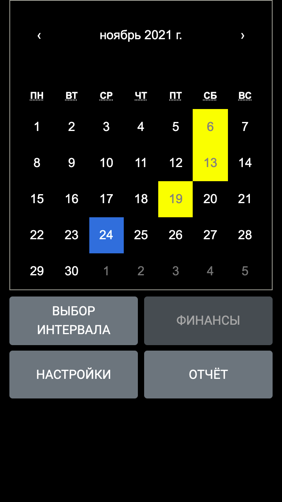
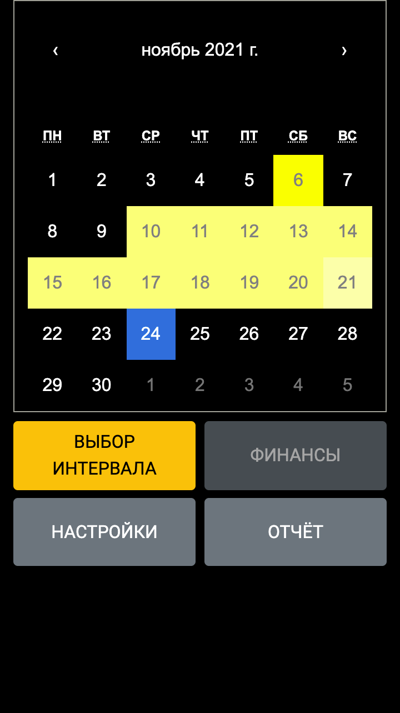
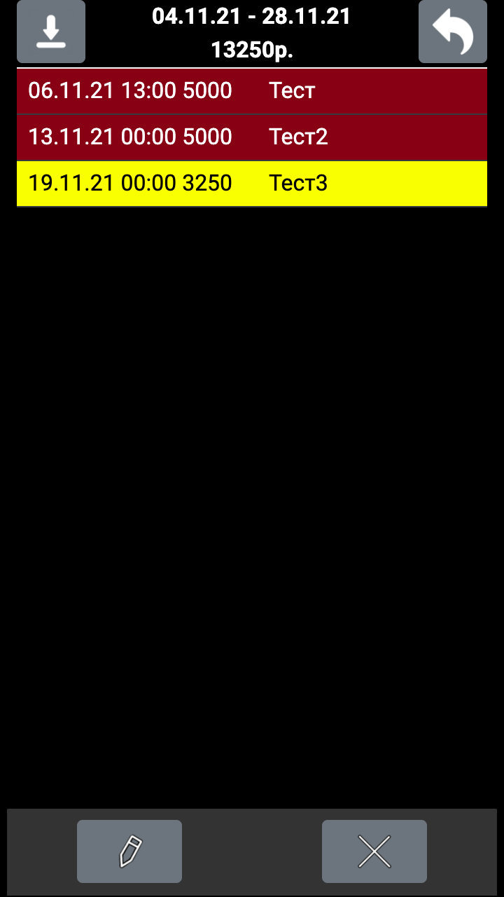
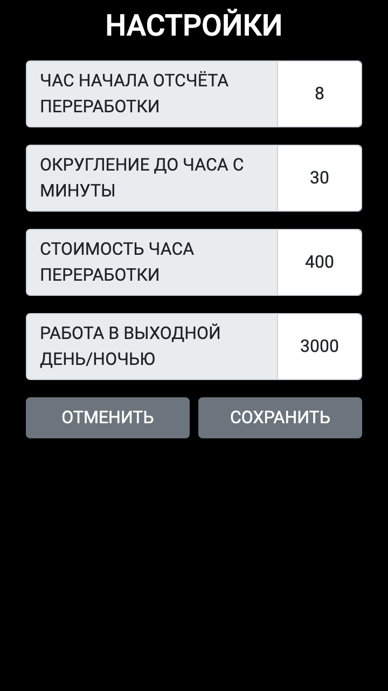
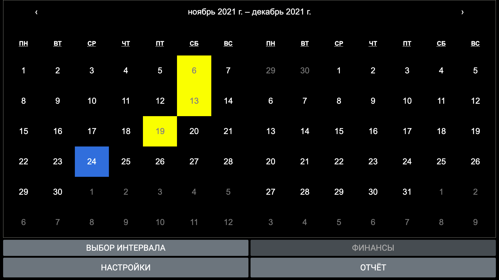

# Overtime
Overtime - web версия (.Net core/React) приложения android для учёта переработок, различных выплат. 

Главная страница

Страница редактирования выбранного дня

Главная страница - выбор интервала

Страница отчёта

Страница отчёта с выбранным днём

Страница настроек

Страница входа на сайт

Главная страница (FHD)

