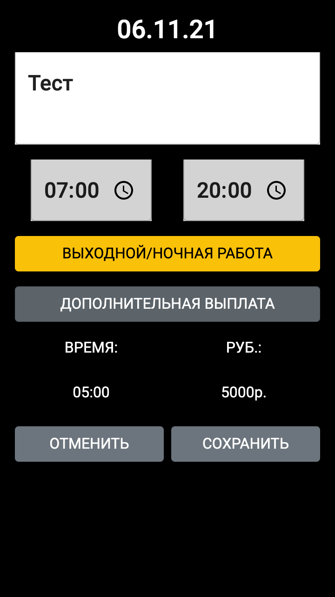

# Overtime
Overtime - web версия (.Net core/React) приложения android для учёта переработок, различных выплат. 
Задача приложения - учёт переработок работников конкретной организации и отрасли с возможностью сохранения данных пользователя в облаке (на случай потери телефона). Для каждого пользователя создаётся отдельный xml файл в который сохраняется вся информация пользователя. Преимущественно используется на мобильном ( оформление десктопной части не доработано). Регистрация - JwtBearer, серверная часть - asp.net core, клиентская - react.

Главная страница. При нажатии на дату пользователь переходит на страницу редактирования дня.

Страница редактирования выбранного дня 

Главная страница - выбор интервала (при нажатии на даты меняется первая и последние даты интервала)

Страница отчёта - отчёт можно сохранить, как .xlsx файл

Страница отчёта с выбранным днём - день можно редактировать и удалять

Страница настроек

Страница входа на сайт

Главная страница (FHD)

